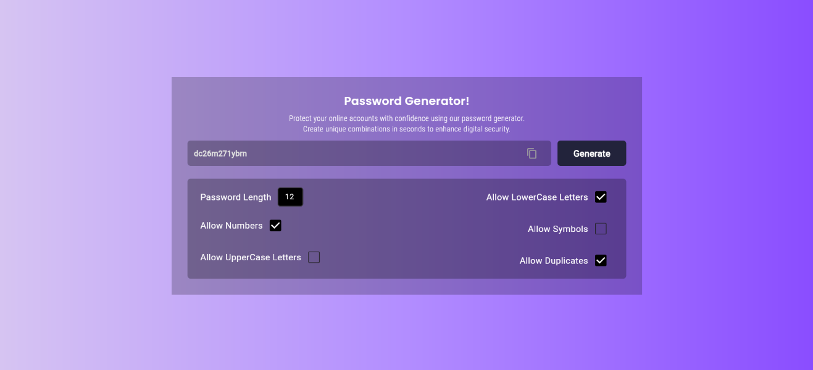

# 🔐 Flutter Password Generator
#### A simple, elegant, and secure password generator built using Flutter(Web App). Easily create strong passwords with customizable options and a smooth UI.
## ✨ Features
📋 Copy to Clipboard – Instantly copy the generated password.

🔢 Password Length Selector – Set the desired password length.

🔣 Character Options:

--> 1.✅ Allow Numbers

--> 2.✅ Allow Uppercase Letters

--> 3.✅ Allow Lowercase Letters

--> 4.✅ Allow Symbols

--> 5.✅ Allow Duplicates in password

## 🚀 Getting Started
### Prerequisites
    Flutter SDK installed
    Dart enabled
    Any IDE like Android Studio, VS Code, etc.

### Installation
#### 1. Clone the repository
    git clone https://github.com/vedantvisoliya/Flutter-Password-Generator-App.git
    cd password_generator_app

#### 2. Get the dependencies
    flutter pub get

#### 3. Run the app
    flutter run

## 🧩 Screenshots
